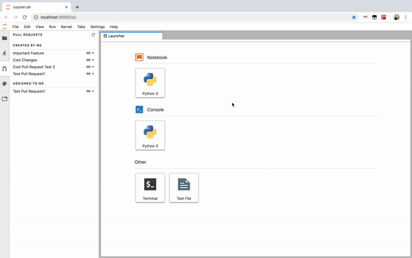

# jupyterlab-pullrequests

[](https://img.shields.io/badge/stability-experimental-red.svg)
[](https://travis-ci.org/jupyterlab/pull-requests)
[](https://www.npmjs.com/package/@jupyterlab/pullrequests)
[](https://pypi.org/project/jupyterlab-pullrequests/)

A JupyterLab extension for reviewing pull requests



## Prerequisites

- JupyterLab 1.0+

## Usage

- Open the pull request extension from the tab on the left panel

## Installation

### 1. Install the extension with the following steps

```bash
jupyter labextension install @jupyterlab/pullrequests
pip install --upgrade jupyterlab-pullrequests
jupyter serverextension enable --py jupyterlab_pullrequests
```

### 2. Getting your access token from GitHub

You can get an access token by following these steps:

1.  [Verify](https://help.github.com/articles/verifying-your-email-address) your email address with GitHub.
1.  Go to your account settings on GitHub and select "Developer Settings" from the left panel.
1.  On the left, select "Personal access tokens"
1.  Click the "Generate new token" button, and enter your password.
1.  Give the token a description, and check the "**repo**" scope box.
1.  Click "Generate token"
1.  You should be given a string which will be your access token.

Remember that this token is effectively a password for your GitHub account.
_Do not_ share it online or check the token into version control,
as people can use it to access all of your data on GitHub.

### 3. Setting your access token in JupyterLab Pull Requests

You now need to add the credentials you got from GitHub
to your notebook configuration file. Instructions for generating a configuration
file can be found [here](http://jupyter-notebook.readthedocs.io/en/stable/config_overview.html#configure-nbserver).
Once you have identified this file, add the following lines to it:

```python
c.GitHubConfig.access_token = '<YOUR_ACCESS_TOKEN>'
```

where "`<YOUR_ACCESS_TOKEN>`" is the string value you obtained above.

Congrats, you did it! Launch JupyterLab and look for the Pull Request tab on the left! 🎉


## Development

### Contributing

If you would like to contribute to the project, please read our [contributor documentation](https://github.com/jupyterlab/pull-requests/blob/master/CONTRIBUTING.md).

JupyterLab follows the official [Jupyter Code of Conduct](https://github.com/jupyter/governance/blob/master/conduct/code_of_conduct.md).

### Install

For a development install, do the following in the repository directory:

```bash
# Install dependencies
jlpm install
# Build Typescript source
jlpm run build
# Link your development version of the extension with JupyterLab
jupyter labextension link .
# Rebuild Typescript source after making changes
jlpm run build
```

```bash
pip install .
jupyter serverextension enable --py jupyterlab_pullrequests
```

To rebuild the package and the JupyterLab app:

```bash
jlpm run build
jupyter lab build
```
